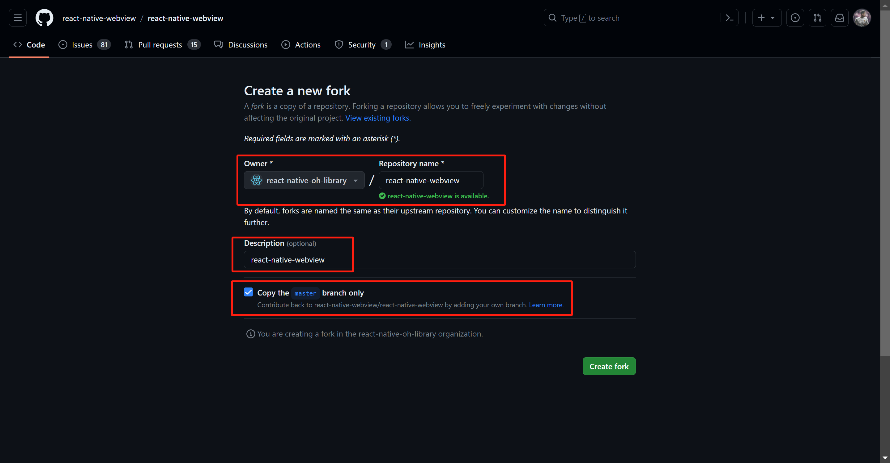
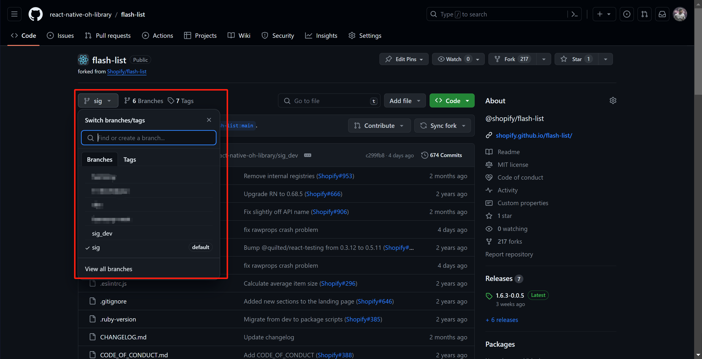
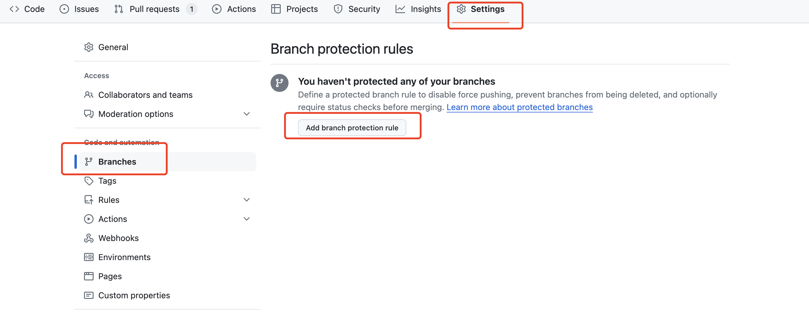
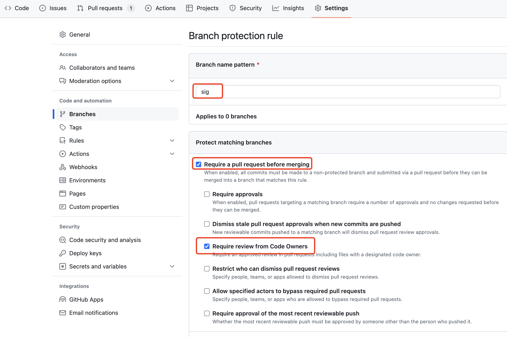
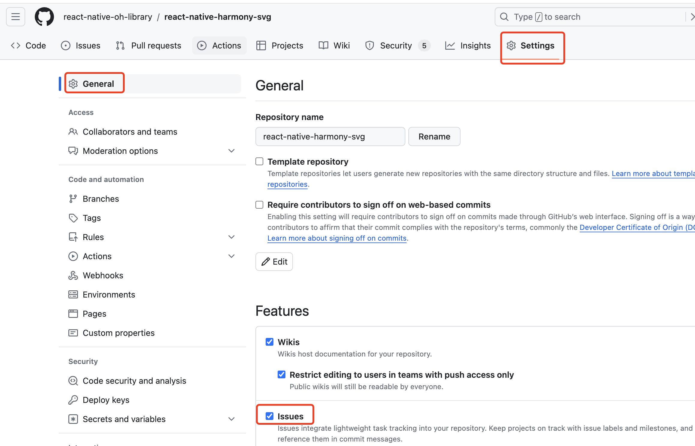
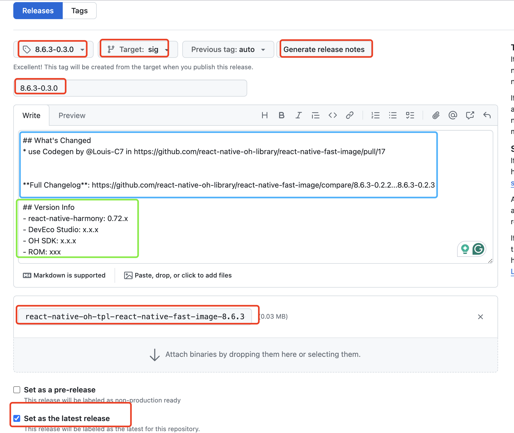

> [!WARNING] 本文档为非公开文档，仅用于三方库使用和开发指导，不涉及任何 React Native OpenHarmony 框架的信息，且会随着 React Native OpenHarmony 框架持续迭代更新，当前版本不代表最终展示版本。

# HarmonyOS RN 三方库规范

## 背景

HarmonyOS React-Native 三方库（以下简称 RNOH 三方库）是 React-Native 社区三方库的 HarmonyOS 平台的延伸。目前不具备回合社区的条件，所以作为补丁包的形式存在。运行时需要同时依赖 react-native 和 react-native-harmony（react-native 的 HarmonyOS 补丁包），还有社区上的原三方库。

目前所有的 RNOH 三方库的源码统一放在 Github 的 [react-native-oh-library](https://github.com/react-native-oh-library) 组织管理，请相关开发者先申请加入。

## 建仓规范

> [!tip] 如果没有建仓权限，请联系组织管理员帮忙操作。

首先确认需要移植的 React-Native 三方库的原始仓库地址，然后 fork 原库的默认分支（一般是 `master` 或 `main`）到 react-native-oh-library 组织。Description 的内容改为这个三方库在 NPM 上的包名。



点击 "View all branches" 修改分支名称为 `sig`，作为仓库的默认分支。开发时，请另外新建开发分支或 fork 该仓库。



将 sig 设置为保护分支，只能通过 Pull Request 的形式合入修改。PR 需写清楚合入的修改，后续会自动生成 Release 信息。





将仓库的 issue 功能开启，方便提交和跟踪三方库问题。



## commit 规范

在团队协作和开源项目中，遵循统一的 Git commit 规范有助于保持代码库整洁、历史记录清晰，并且方便代码审查和问题追踪。以下是开源社区推荐的最佳实践：

### 使用标准的提交消息格式

#### 标题（header）

标题行是必须的，简洁明了地描述提交的目的，一般不超过 50 个字符。

格式通常为：

`<type>(<scope>): <subject>`

**type** ：表示提交的类别，常见类型包括：

- `feat`：新功能（feature）
- `fix`：修补 bug
- `docs`：文档变更
- `style`：代码格式（不影响代码运行的变动）
- `refactor`：重构（既不是新增功能，也不是修复 bug 的代码变动）
- `perf`：优化相关，比如提升性能、体验
- `test`：增加测试
- `chore`：构建过程或辅助工具的变动
- `ci`: 修改集成配置的文件或者脚本

**scope**：表示影响范围（可选），例如模块或文件名。

**subject**：一句话描述这次提交的目的，使用动词开头，如 "Add"，"Fix"，"Update" 等。

#### 示例：

```
feat(auth): add login functionality
fix(button): correct hover state on Safari
docs(readme): update installation instructions
```

## 发布规范

发布步骤：

1. 确保已通过自检测试，并完成代码格式检查；
2. 确保已将变更合入 `sig` 分支
3. 提交发布相关信息(oh-package 版本、package 版本和 har)，参考 [release commit](https://github.com/react-native-oh-library/react-native-harmony-svg/commit/a35397ff4a030860ca4e9ba8e9646428869c822e).
4. 发布新的 Tag 和 Release（github 上操作）；

### 代码格式检查

请查看 [代码格式检查](zh-cn/codelint.md) 章节

### Tags and Releases

按以下步骤操作：

1. Tag 名称、Release 名称一致:

> x.x.x-y.y.y

具体的版本命名方式请阅读[版本控制](/zh-cn/deprecated/version-control.md)章节。

2. Target 分支 选择默认分支 sig（请确保变更已通过测试、代码检查和合入了默认分支）

3. Release 使用自动生成功能（生成内容如蓝框所示），然后手动额外添加版本信息（绿框内的内容）：

```md
## Version Info

- react-native-harmony: 0.72.x
- DevEco Studio: x.x.x
- HarmonyOS SDK: x.x.x
- ROM: xxx
```

4. 需要上传本地打包的 tgz 文件



> [!TIP] Generate release notes 功能会自动根据两个 Tag 之间的异同生成 Release 信息，历史 PR 信息会生成到 What's Changed 下。

### Package 的命名规则：

**情况 1.** 如果原库在 NPM 上的包带有组织前缀，如 "@react-native-community/slider", "@react-native-async-storage/async-storage"等；

去掉组织名取后半段：

> "@react-native-oh-tpl/原包名后半段"

example：

```md
"@shopify/flash-list" → "@react-native-oh-tpl/flash-list"
```

**情况 2.** 如果原库在 NPM 上的包没有组织前缀，如 "react-native-pager-view" 等；

直接添加新的组织名：

> "@react-native-oh-tpl/原包名"

example：

```md
"react-native-pager-view" → "@react-native-oh-tpl/react-native-pager-view"
```

如果有重名等其他特殊情况，请联系组织管理员协商。

## 补丁形式说明

RNOH 三方库的文件结构和原库保持一致，遵循能不修改原库内容就不修改的原则，在此基础上进行鸿蒙化适配。

RNOH 三方库以原库补丁的形式发布（若原库需要鸿蒙化适配，部分库可以直接使用原库），开发者安装使用时需要安装原库和 HarmonyOS 补丁库，但开发时还是从同一个库名里导入模块。

也就是说，将 HarmonyOS 平台的代码解耦出来，变成一个独立的 npm 包，和原来的 npm 包是依赖关系。当使用 metro 服务打包时，会根据平台和别名判断，是去 node_modules 下哪个文件夹里读取模块。

以 react-native-linear-gradient 为例，官方的 npm 包名是 `react-native-linear-gradient`，HarmonyOS 平台补丁的 npm 包名命名为 `@react-native-oh-tpl/react-native-linear-gradient`。

**Android/iOS:**

当在 React-Native 项目内运行 Android 或 iOS 平台时，与正常引入该三方库没有区别，JS 端的代码和原生代码都会从 `node_modules/react-native-linear-gradient` 里查询。

**HarmonyOS:**

需要删除安卓和 iOS 实现

```
.
├── harmony
├── android // 删除
├── apple // 删除
├── ios // 删除
├── package.json
```

需要添加别名

在 `package.json` 里添加 "harmony" 字段：

```json
{
    "harmony": {
        "alias": {原NPM包名}
    },
}
```

例：@react-native-oh-tpl/react-native-linear-gradient 的 `package.json` 需要添加一个 `"harmony": {"alias"}` 字段，这个别名就是原库的名字，用于给 metro 识别打包

```json
...
"harmony": {
    "alias": "react-native-linear-gradient"
}
```

当运行 HarmonyOS 平台时，metro 服务首先会筛选出所有含有 `harmony` 文件夹的三方库，然后再进行别名查询，在筛选出来的三方库中的 package.json 内查找有没有 `"harmony": {"alias"}` 字段。如有，将会和别名指向的库链接起来。

在打包的时候，将不会从 `node_modules/react-native-linear-gradient` 里拿取 JS 代码，而是从 `node_modules/@react-native-oh-tpl/react-native-linear-gradient` 内拿取代码，但开发者使用时， import 的库名称并不会改变，如：

```ts
import LinearGradient from "react-native-linear-gradient";
```

这就实现了 HarmonyOS 平台和其他平台的解耦。HarmonyOS 平台因目前还不支持 Autolink，所以原生代码自行指定路径即可。

### 示例

> [!tip] 补丁包的文件结构并没有太大变化，只是将 Android 和 ios 的原生部分、部分 JS 代码和一些无关项（example 工程等）剔除了，主要由两个部分组成：HarmonyOS 原生代码和修改后的 JS 代码。

**对于原生代码：**仅保留 HarmonyOS 平台的部分，即 `harmony` 文件夹。

**对于 JS 代码：**仅保留有改动的部分，其余直接从原库里 import。

首先需要在 github 仓库上新增 sig 分支（若不存在），作为补丁版本的分支。sig 分支的具体建立规则请参考 **建仓规范**

> [!WARNING] 目录结构需要和原库保持一致！

我们要尽量遵循**能少改就少改的原则**，对于新架构的三方库，剔除了其他平台后，如果 JS 代码无改动，理论上只需要重新在 index 中重新导出即可。若有 harmony 平台的改动，则需要保留。

平台间的解耦不意味着 npm 包的解耦，实际上 JS 侧还需要依赖原库的代码。

所以还需要在 `package.json` 的 "dependencies" 字段添加对原库的依赖，版本填基于原库的版本。

```json
"dependencies": {
    "react-native-linear-gradient": "x.x.x"
  },
```

**可供参考的库：**

| 原库名                                | 仓库地址                                                                                            |
| ------------------------------------- | --------------------------------------------------------------------------------------------------- |
| react-native-svg                      | [OpenHarmony SIG](https://github.com/react-native-oh-library/react-native-harmony-svg)              |
| react-native-linear-gradient          | [OpenHarmony SIG](https://github.com/react-native-oh-library/react-native-linear-gradient/tree/sig) |
| @react-native-community/slider        | [OpenHarmony SIG](https://github.com/react-native-oh-library/react-native-slider/tree/sig)          |
| @react-native-picker/picker           | [OpenHarmony SIG](https://github.com/react-native-oh-library/picker/tree/sig)                       |
| react-native-pager-view               | [OpenHarmony SIG](https://github.com/react-native-oh-library/react-native-pager-view/tree/sig)      |
| @react-native-masked-view/masked-view | [OpenHarmony SIG](https://github.com/react-native-oh-library/masked-view/tree/sig)                  |
| react-native-fast-image               | [OpenHarmony SIG](https://github.com/react-native-oh-library/react-native-fast-image/tree/sig)      |

## 版本管理规范

请阅读[版本控制](/zh-cn/deprecated/version-control.md)章节。
