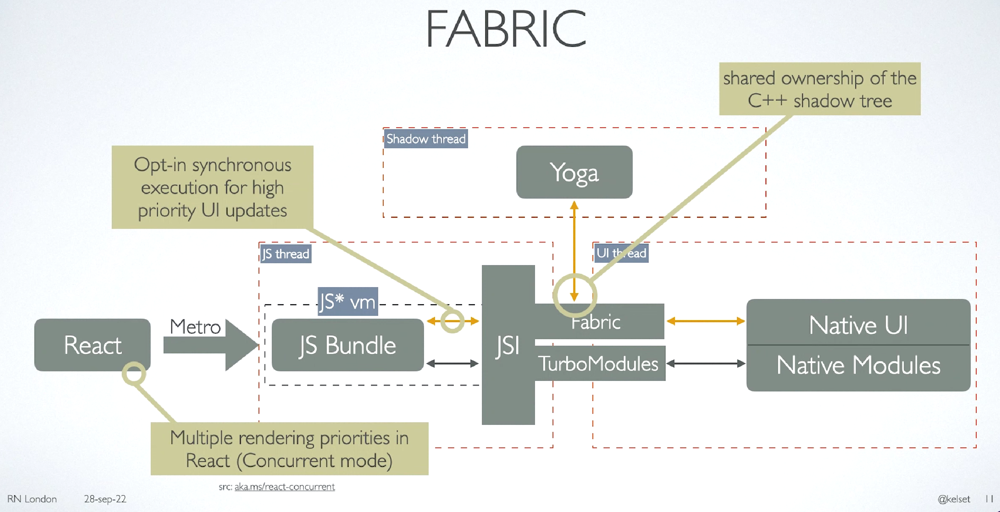

> [!WARNING] 本文档为非公开文档，仅用于三方库使用和开发指导，不涉及任何 React Native OpenHarmony 框架的信息，且会随着 React Native OpenHarmony 框架持续迭代更新，当前版本不代表最终展示版本。

# Fabric 组件

Fabric 组件是一种使用 Fabric 渲染器渲染并展示在屏幕上的 UI 组件。



在开发 Fabric 组件前，需要先创建一个 JavaScript 接口描述文件。之后 Codegen 会根据这个文件创建一些 C++ 脚手架代码，用于将部分组件逻辑（比如调用原生平台接口能力）与 React Native 结合起来。C++ 代码在各个平台都是一样的，只要组件能够与生成的 C++ 代码连接起来，就可以导入到 App 并运行。

## 如何创建 Fabric 组件

若要创建一个 Fabric 组件，需要遵循以下步骤：

1. 声明 JavaScript 接口；
2. 配置组件以用于 Codegen 生成统一代码，生成的代码可添加为 App 的依赖；
3. 编写所需的原生代码。

接下来会创建一个简单的名为 `RTNCenteredText` 的 Fabric 组件作为示例。

## 目录配置

同样的，我们按照一般的三方库目录结构来配置:

```
.
├── MyApp
└── RTNCenteredText
    ├── android（Android 的原生实现代码）
    ├── ios（iOS 的原生实现代码）
    ├── harmony（HarmonyOS 的原生实现代码）
    └── src （js/ts代码）
```

### 1. 声明 JavaScript 接口

新架构要求必须使用强类型风格语言声明 JavaScript 接口（Flow 和 TypeScript 皆可）。Codegen 会根据这些接口声明来生成强类型的语言，其中包括 C++、Objective-C 和 Java。

对于声明类型的代码文件必须满足以下两点要求：

1. 文件必须使用 `<MODULE_NAME>NativeComponent` 命名，在使用 Flow 时，以 `.js` 或 `.jsx` 为后缀名；在使用 Typescript 时，以 `.ts` 或 `.tsx` 为后缀名。Codegen 只会找到匹配这些命名规则的文件；

2. 代码中必须要输出 HostComponent 对象。

以下是使用 Flow 和 TypeScript 声明的 RTNCenteredText 组件。在 `js` 目录中，创建一个命名为 `RTNCenteredText` 并带有相应后缀名的文件。

<!-- tabs:start -->

#### **flow**

RTNCenteredTextNativeComponent.js

```js
// @flow strict-local

import type { ViewProps } from "react-native/Libraries/Components/View/ViewPropTypes";
import type { HostComponent } from "react-native";
import codegenNativeComponent from "react-native/Libraries/Utilities/codegenNativeComponent";

type NativeProps = $ReadOnly<{|
  ...ViewProps,
  text: ?string,
  // add other props here
|}>;

export default (codegenNativeComponent<NativeProps>(
  "RTNCenteredText"
): HostComponent<NativeProps>);
```

#### **typescript**

RTNCenteredTextNativeComponent.ts

```ts
import type { ViewProps } from "ViewPropTypes";
import type { HostComponent } from "react-native";
import codegenNativeComponent from "react-native/Libraries/Utilities/codegenNativeComponent";

export interface NativeProps extends ViewProps {
  text?: string;
  // 添加其它 props
}

export default codegenNativeComponent<NativeProps>(
  "RTNCenteredText"
) as HostComponent<NativeProps>;
```

<!-- tabs:end -->

在声明文件的顶部导入了一些内容。以下是开发 Fabric 组件必须要导入的内容：

- `HostComponent` 类型: 导出的组件需要与这个类型保持一致；
- `codegenNativeComponent` 函数：负责将组件注册到 JavaScript 运行时。
  声明文件的中间部分包含了组件的 props。Props（"properties" 的缩写）是用于自定义 React 组件的参数信息。在本例中，需要控制组件的 text 属性。

在声明文件的最后部分，导出了泛型函数 `codegenNativeComponent` 的返回值，此函数需要传递组件的名称。

### 2. Codegen 配置

#### Shared

shared 是 package.json 文件中的一个配置项，它将在 yarn/npm 安装模块时被调用。请在 `RTNCenteredText` 的根目录创建 `package.json` 文件。

```json
{
  "name": "rtn-centered-text",
  "version": "0.0.1",
  "description": "Showcase a Fabric component with a centered text",
  "react-native": "src/index",
  "source": "src/index",
  "files": [
    "src",
    "android",
    "ios",
    "harmony",
    "rtn-centered-text.podspec",
    "!android/build",
    "!ios/build",
    "!**/__tests__",
    "!**/__fixtures__",
    "!**/__mocks__"
  ],
  "keywords": ["react-native", "ios", "android", "harmony"],
  "repository": "https://github.com/<your_github_handle>/rtn-centered-text",
  "author": "<Your Name> <your_email@your_provider.com> (https://github.com/<your_github_handle>)",
  "license": "MIT",
  "bugs": {
    "url": "https://github.com/<your_github_handle>/rtn-centered-text/issues"
  },
  "homepage": "https://github.com/<your_github_handle>/rtn-centered-text#readme",
  "devDependencies": {},
  "peerDependencies": {
    "react": "*",
    "react-native": "*"
  },
  "harmony": {
    "codegenConfig": {
      "specPaths": [
        "./src"
      ]
    }
  },
  "codegenConfig": {
    "name": "RTNCenteredTextSpecs",
    "type": "components",
    "jsSrcsDir": "src"
  }
}
```

将 Codegen 的配置声明到 codegenConfig 字段。codegenConfig 是一个用于存放要生成的第三方库的对象数组，每个对象又包含其它三个字段：

- name：第三方库的名称。按照惯例，名称应以 Spec 为结尾
- type：在这个 npm 包里的模块类型。在本例中，我们开发的是 Turbo Native Module，所以值为 modules
- jsSrcsDir：用于找到 js 接口声明文件的相对路径，它将被 Codegen 解析

#### Android

若要在 Android 平台运行 Codegen，需要创建三个文件：

1. 带有 Codegen 配置信息的 build.gradle 文件
2. AndroidManifest.xml
3. 一个实现 ReactPackage 接口的 Java 类

在文件创建完成后，`android` 目录文件结构应该是这样的：

```md
android
├── build.gradle
└── src
    └── main
        ├── AndroidManifest.xml
        └── java
            └── com
                └── rtncenteredtext
                    └── RTNCenteredTextPackage.java
```

首先，在 `android` 目录创建 `build.gradle` 文件，并配置以下内容：

**build.gradle**

<!-- tabs:start -->

#### **build.gradle**

```gradle
buildscript {
  ext.safeExtGet = {prop, fallback ->
    rootProject.ext.has(prop) ? rootProject.ext.get(prop) : fallback
  }
  repositories {
    google()
    gradlePluginPortal()
  }
  dependencies {
    classpath("com.android.tools.build:gradle:7.1.1")
  }
}

apply plugin: 'com.android.library'
apply plugin: 'com.facebook.react'

android {
  compileSdkVersion safeExtGet('compileSdkVersion', 31)

  defaultConfig {
    minSdkVersion safeExtGet('minSdkVersion', 21)
    targetSdkVersion safeExtGet('targetSdkVersion', 31)
    buildConfigField("boolean", "IS_NEW_ARCHITECTURE_ENABLED", "true")
  }
}

repositories {
  maven {
    // All of React Native (JS, Obj-C sources, Android binaries) is installed from npm
    url "$projectDir/../node_modules/react-native/android"
  }
  mavenCentral()
  google()
}

dependencies {
  implementation 'com.facebook.react:react-native:+'
}
```

<!-- tabs:end -->

其次，创建 `android/src/main` 目录，然后在这个目录内创建 `AndroidManifest.xml` 文件，并编写以下代码：

<!-- tabs:start -->

#### **AndroidManifest.xml**

```xml
<manifest xmlns:android="http://schemas.android.com/apk/res/android"
          package="com.rtncenteredtext">
</manifest>
```

<!-- tabs:end -->

这个 manifest 文件的用途是声明您开发的模块的 Java 包

最后，您需要一个继承 TurboReactPackage 接口的类。在运行 Codegen 前，您不用完整实现这个类。对于 App 而言，一个没有实现接口的空类就已经能当做一个 React Native 依赖，Codegen 会尝试生成其脚手架代码。

创建 `android/src/main/java/com/rtncenteredtext` 目录，在这个目录内创建 `RTNCenteredTextPackage.java` 文件

**RTNCenteredTextPackage.java**

<!-- tabs:start -->

#### **RTNCenteredTextPackage.java**

```java
package com.rtncenteredtext;

import com.facebook.react.ReactPackage;
import com.facebook.react.bridge.NativeModule;
import com.facebook.react.bridge.ReactApplicationContext;
import com.facebook.react.uimanager.ViewManager;

import java.util.Collections;
import java.util.List;

public class RTNCenteredTextPackage implements ReactPackage {

    @Override
    public List<ViewManager> createViewManagers(ReactApplicationContext reactContext) {
        return Collections.emptyList();
    }

    @Override
    public List<NativeModule> createNativeModules(ReactApplicationContext reactContext) {
        return Collections.emptyList();
    }

}
```

<!-- tabs:end -->

ReactPackage 接口的用途是让 React Native 为使用 App 中的 ViewManager 和 Native Modules，识别出哪些原生类需要在第三方库里导出。

Codegen 会在 App 编译的时候自动运行。

#### HarmonyOS (ArkTS Fabric)

> [!WARNING] 接入 codegen 之后，同一个模块中 ArkTS 版本和 CAPI 版本的 Fabric 无法共存，请先选择好实现方式

HarmonyOS 需要在 RN 工程中通过运行脚本来执行 Codegen。

打开 RN 工程下的 package.json，如 `MyApp/package.json`，添加：

```json
{
  ...
  "scripts": {
    ...
    "codegen": "react-native codegen-harmony --rnoh-module-path ./harmony/react_native_openharmony"
  },
  ...
}
```

> codegen-harmony 参数介绍：

1. --rnoh-module-path: 指定 @rnoh/react-native-openharmony 模块的相对路径，用于存储生成的 ts 文件；如果使用 har 包引入 rnoh 模块，则需要指向：./harmony/entry/oh_modules/@rnoh/react-native-openharmony"

2. --cpp-output-path: 指定用于存储生成的 C++ 文件的输出目录的相对路径，默认 ./harmony/entry/src/main/cpp/generated；

3. --project-root-path: 包根目录的相对路径。

#### HarmonyOS (CAPI Fabric)

> [!WARNING] 接入 codegen 之后，同一个模块中 ArkTS 版本和 CAPI 版本的 Fabric 无法共存，请先选择好实现方式

目前 Codegen 暂时不支持构造 CAPI 版本的 Fabric 模块，，所以我们需要手动运行 Android 的 Codegen，然后把生成的代码复制过来使用。

> [!WARNING] 请务必先把 Android 的 Codegen 配置好再执行以下操作

删除 package.json 中的 harmony.codegenConfig 字段

```diff
{
  ...
  "harmony": {
-   "codegenConfig": {
-     "specPaths": [
-       "./src"
-     ]
-   }
  },
}
```

首先我们需要一个 React-Native App 来执行 Codegen，假设 App 的目录是和 当前目录平级的 `MyApp`，执行以下命令来创建一个 Gradle 任务来执行 Codegen。

> [!tip] 在运行 Codegen 之前，您需要在 Android 中的 App 启动新架构。您可以通过修改 gradle.properties 文件中的 newArchEnabled 属性，将 false 改为 true。

```bash
// 进入模块工程
cd RTNCenteredText

// 打包模块
npm pack

// 进入 App 工程
cd ../MyApp

// 本地路径安装模块
npm i file:../RTNCenteredText/rtn-centered-text-0.0.1.tgz

cd android

./gradlew generateCodegenArtifactsFromSchema
```

生成后的代码保存在 `MyApp/node_modules/rtn-centered-text/android/build/generated/source/codegen` 目录，并呈以下结构：

```md
codegen
├── java
│   └── com
│       └── facebook
│           └── react
│               └── viewmanagers
│                   ├── RTNCenteredTextManagerDelegate.java
│                   └── RTNCenteredTextManagerInterface.java
├── jni
│   ├── Android.mk
│   ├── CMakeLists.txt
│   ├── RTNCenteredText-generated.cpp
│   ├── RTNCenteredText.h
│   └── react
│       └── renderer
│           └── components
│               └── RTNCenteredText
│                   ├── ComponentDescriptors.h
│                   ├── EventEmitters.cpp
│                   ├── EventEmitters.h
│                   ├── Props.cpp
│                   ├── Props.h
│                   ├── RTNCenteredTextSpecsJSI-generated.cpp
│                   ├── RTNCenteredTextSpecsJSI.h
│                   ├── ShadowNodes.cpp
│                   ├── ShadowNodes.h
│                   ├── States.cpp
│                   └── States.h
└── schema.json
```

`codegen/jni/react/renderer/components/RTNCenteredText` 目录下的代码是 HarmonyOS 需要的。（RTNCenteredTextSpecsJSI-generated.cpp、RTNCenteredTextSpecsJSI.h除外）

将这些代码文件复制到 `harmony/rtn-centered-text/src/main/cpp` 文件夹下，并 **修改一下各文件 "include" 的路径**。

如 `ComponentDescriptor.h`

```diff
...
- #include <react/renderer/components/RTNCenteredTextSpecs/ShadowNodes.h>
+ #include "ShadowNodes.h"
#include <react/renderer/core/ConcreteComponentDescriptor.h>
...
```

然后在同级目录创建 `CMakeLists.txt`，`RTNCenteredTextJSIBinder.h`，`RTNCenteredTextPackage.h`，目录结构如下

```md
harmony
└── rtn-centered-text
    ├── src
    │   └── main
    │       ├── cpp
    │       │   ├── CMakeLists.txt
    │       │   ├── ComponentDescriptors.h
    │       │   ├── EventEmitters.cpp
    │       │   ├── EventEmitters.h
    │       │   ├── Props.cpp
    │       │   ├── Props.h
    │       │   ├── ShadowNodes.cpp
    │       │   ├── ShadowNodes.h
    │       │   ├── States.cpp
    │       │   ├── States.h
    │       │   ├── RTNCenteredTextJSIBinder.h
    │       │   └── RTNCenteredTextPackage.h
    │       └── modules.json5         
    ├── build-profile.json5
    ├── hvigorfile.ts
    └── oh-package.json5
```

<!-- tabs:start -->

#### **CMakeLists.txt**

```c
# the minimum version of CMake
cmake_minimum_required(VERSION 3.13)
set(CMAKE_VERBOSE_MAKEFILE on)

file(GLOB rtn_centered_text_SRC CONFIGURE_DEPENDS *.cpp)
add_library(rtn_centered_text SHARED ${rtn_centered_text_SRC})
target_include_directories(rtn_centered_text PUBLIC ${CMAKE_CURRENT_SOURCE_DIR})
target_link_libraries(rtn_centered_text PUBLIC rnoh)
```

<!-- tabs:end -->

<!-- tabs:start -->

#### **RTNCenteredTextJSIBinder.h**

```cpp
#include "RNOHCorePackage/ComponentBinders/ViewComponentJSIBinder.h"

namespace rnoh {

class RTNCenteredTextJSIBinder : public ViewComponentJSIBinder {
    facebook::jsi::Object createNativeProps(facebook::jsi::Runtime &rt) override {
        auto object = ViewComponentJSIBinder::createNativeProps(rt);
        object.setProperty(rt, "text", "string");
        return object;
    }
};
} // namespace rnoh
```

<!-- tabs:end -->

JSI Binder 的作用是桥接 JS 和 C++，将属性从 JS 端传递到 C++ 端。

<!-- tabs:start -->

<!-- tabs:start -->

#### **RTNCenteredTextPackage.h**

```cpp
#include "RNOH/Package.h"
#include "ComponentDescriptors.h"
#include "RTNCenteredTextJSIBinder.h"

namespace rnoh {

class RTNCenteredTextPackage : public Package {
public:
    CenteredTextPackage(Package::Context ctx): Package(ctx) {}

    std::vector<facebook::react::ComponentDescriptorProvider> createComponentDescriptorProviders() override {
        return {facebook::react::concreteComponentDescriptorProvider<facebook::react::RTNCenteredTextComponentDescriptor>()};
    }

    ComponentJSIBinderByString createComponentJSIBinderByName() override {
        return {{"RTNCenteredText", std::make_shared<RTNCenteredTextJSIBinder>()}};
    }
};
} // namespace rnoh
```

<!-- tabs:end -->

Package 接口的用途是让 React-Native 识别出三方库需要导出哪些 C++ 接口。

### 3. 原生代码

#### Android

Android 平台中 Fabric 组件的原生代码必须包含以下三个部分：

1. RTNCenteredText.java 用于渲染原生视图
2. RTNCenteredTextManager.java 用于实例化原生视图
3. 在 RTNCenteredTextPackage.java 实现具体的逻辑代码

Android 第三方库目录文件结构应为如下：

```md
android
├── build.gradle
└── src
    └── main
        ├── AndroidManifest.xml
        └── java
            └── com
                └── rtncenteredtext
                    ├── RTNCenteredText.java
                    ├── RTNCenteredTextManager.java
                    └── RTNCenteredTextPackage.java
```

<!-- tabs:start -->

#### **RTNCenteredText.java**

```java
package com.rtncenteredtext;

import androidx.annotation.Nullable;
import android.content.Context;
import android.util.AttributeSet;
import android.graphics.Color;

import android.widget.TextView;
import android.view.Gravity;

public class RTNCenteredText extends TextView {

    public RTNCenteredText(Context context) {
        super(context);
        this.configureComponent();
    }

    public RTNCenteredText(Context context, @Nullable AttributeSet attrs) {
        super(context, attrs);
        this.configureComponent();
    }

    public RTNCenteredText(Context context, @Nullable AttributeSet attrs, int defStyleAttr) {
        super(context, attrs, defStyleAttr);
        this.configureComponent();
    }

    private void configureComponent() {
        this.setBackgroundColor(Color.RED);
        this.setGravity(Gravity.CENTER_HORIZONTAL);
    }
}
```

<!-- tabs:end -->

这个类表示的是原生视图，将由 Android 渲染到屏幕上。它继承了 TextView 并且调用私有方法 configureComponent() 来配置自身的基本参数。

<!-- tabs:start -->

#### **RTNCenteredTextManager.java**

```java
package com.rtncenteredtext;

import androidx.annotation.NonNull;
import androidx.annotation.Nullable;

import com.facebook.react.bridge.ReadableArray;
import com.facebook.react.bridge.ReactApplicationContext;
import com.facebook.react.module.annotations.ReactModule;
import com.facebook.react.uimanager.SimpleViewManager;
import com.facebook.react.uimanager.ThemedReactContext;
import com.facebook.react.uimanager.ViewManagerDelegate;
import com.facebook.react.uimanager.annotations.ReactProp;
import com.facebook.react.viewmanagers.RTNCenteredTextManagerInterface;
import com.facebook.react.viewmanagers.RTNCenteredTextManagerDelegate;


@ReactModule(name = RTNCenteredTextManager.NAME)
public class RTNCenteredTextManager extends SimpleViewManager<RTNCenteredText>
        implements RTNCenteredTextManagerInterface<RTNCenteredText> {

    private final ViewManagerDelegate<RTNCenteredText> mDelegate;

    static final String NAME = "RTNCenteredText";

    public RTNCenteredTextManager(ReactApplicationContext context) {
        mDelegate = new RTNCenteredTextManagerDelegate<>(this);
    }

    @Nullable
    @Override
    protected ViewManagerDelegate<RTNCenteredText> getDelegate() {
        return mDelegate;
    }

    @NonNull
    @Override
    public String getName() {
        return RTNCenteredTextManager.NAME;
    }

    @NonNull
    @Override
    protected RTNCenteredText createViewInstance(@NonNull ThemedReactContext context) {
        return new RTNCenteredText(context);
    }

    @Override
    @ReactProp(name = "text")
    public void setText(RTNCenteredText view, @Nullable String text) {
        view.setText(text);
    }
}
```

<!-- tabs:end -->

RTNCenteredTextManager 类用于让 React Native 实例化原生组件，它实现了由 Codegen 生成的接口（见 implements 语句的 RTNCenteredTextManagerInterface 接口）并使用了 RTNCenteredTextManagerDelegate 类。

它同时负责导出所有 React Native 所需的内容，例如使用 @ReactModule 注解的 RTNCenteredTextManager 类，及使用 @ReactProp 注解的 setText 方法。

**RTNCenteredText.java**

最后，打开 `android/src/main/java/com/rtncenteredtext` 目录的 `RTNCenteredTextPackage.java`，并进行以下修改：

<!-- tabs:start -->

#### **RTNCenteredTextPackage update**

```diff
package com.rtncenteredtext;

import com.facebook.react.ReactPackage;
import com.facebook.react.bridge.NativeModule;
import com.facebook.react.bridge.ReactApplicationContext;
import com.facebook.react.uimanager.ViewManager;

import java.util.Collections;
import java.util.List;

public class RTNCenteredTextPackage implements ReactPackage {

    @Override
    public List<ViewManager> createViewManagers(ReactApplicationContext reactContext) {
+        return Collections.singletonList(new RTNCenteredTextManager(reactContext));;
    }

    @Override
    public List<NativeModule> createNativeModules(ReactApplicationContext reactContext) {
        return Collections.emptyList();
    }

}
```

<!-- tabs:end -->

新增的代码实例化了一个 RTNCenteredTextManager 对象，用于让 React Natve 运行时渲染 Fabric 组件。

#### HarmonyOS (ArkTS Fabric)

HarmonyOS 平台中 ArkTS 版本的 Fabric 组件的原生代码必须包含以下三个部分：

1. 创建用于实现组件的 RTNCenteredText.ets
2. 创建 RTNCenteredTextPackage.ts
3. 创建用于导出模块的 index.ets 和 ts.ts
4. 修改 oh-package.json5，hvigorfile.ts，module.json5

> [!TIP] 可以在 DevEco Studio 中通过 File -> New -> Module.. -> Static Lirbrary 创建空壳模块，以此为基础修改文件内容

HarmonyOS 原生代码文件结构应为如下：

```md
harmony
└── rtn-centered-text
    ├── src
    │   └── main
    │       ├──ets
    |       |   ├── RTNCenteredTextPackage.ts
    │       │   └── RTNCenteredText.ets
    │       └── modules.json5         
    ├── build-profile.json5
    ├── hvigorfile.ts
    ├── index.ets
    ├── oh-package.json5
    └── ts.ts
```

<!-- tabs:start -->

#### **RTNCenteredText.ets**

```ts
import { RNComponentContext, RNViewBase } from '@rnoh/react-native-openharmony';
// import codegen 生成的内容
import { RNC } from "@rnoh/react-native-openharmony/generated";

@Component
export struct RTNCenteredText {
  public static readonly NAME = RNC.RTNCenteredText.NAME
  public ctx!: RNComponentContext
  public tag: number = 0
  @State private descriptorWrapper: RNC.RTNCenteredText.DescriptorWrapper = {} as RNC.RTNCenteredText.DescriptorWrapper
  private eventEmitter: RNC.RTNCenteredText.EventEmitter | undefined = undefined
  private cleanUpCallbacks: (() => void)[] = []

  aboutToAppear() {
    this.eventEmitter = new RNC.RTNCenteredText.EventEmitter(this.ctx.rnInstance, this.tag)
    this.onDescriptorWrapperChange(this.ctx.descriptorRegistry.findDescriptorWrapperByTag<RNC.RTNCenteredText.DescriptorWrapper>(this.tag)!)
    this.cleanUpCallbacks.push(this.ctx.descriptorRegistry.subscribeToDescriptorChanges(this.tag,
      (_descriptor, newDescriptorWrapper) => {
        this.onDescriptorWrapperChange(newDescriptorWrapper! as RNC.RTNCenteredText.DescriptorWrapper)
      }
    ))
  }

  private onDescriptorWrapperChange(descriptorWrapper: RNC.RTNCenteredText.DescriptorWrapper) {
    this.descriptorWrapper = descriptorWrapper
  }

  aboutToDisappear() {
    this.cleanUpCallbacks.forEach(cb => cb())
  }

  build() {
    RNViewBase({ ctx: this.ctx, tag: this.tag }) {
      Text(this.descriptorWrapper.props.text)
        .height("100%")
        .width("100%")
        .fontSize(30)
        .textAlign(TextAlign.Center)
    }
  }
}
```

<!-- tabs:end -->

该部分是 RTNCenteredText 的 HarmonyOS 原生实现。

创建 `ts.ts`

<!-- tabs:start -->

#### **ts.ts**

```ts
export * from "./src/main/ets/RTNCenteredTextPackage";
```

<!-- tabs:end -->

创建 `index.ets`

<!-- tabs:start -->

#### **index.ets**

```ts
export * from "./ts";
export * from "./src/main/ets/RTNCenteredText";
```

<!-- tabs:end -->

#### HarmonyOS (CAPI Fabric)

HarmonyOS 平台中 CAPI 版本的 Fabric 组件的原生代码必须包含以下部分：

1. 创建用于实现组件的 RTNCenteredTextComponentInstance.h、RTNCenteredTextComponentInstance.cpp；
2. 创建用于对接 ArkUI的 xxxNode.h、xxxNode.cpp；（若框架已经实现相关的Node，此步可以跳过。本例中需要用到的 TextNode、StackNode 框架已经实现，故无需自行创建）
3. Cpp 脚手架（请看 codegen 章节）
4. 修改 oh-package.json5，hvigorfile.ts，module.json5

> [!TIP] 可以在 DevEco Studio 中通过 File -> New -> Module.. -> Static Lirbrary 创建空壳模块，以此为基础修改文件内容

HarmonyOS 原生代码文件结构应为如下：

```md
harmony
└── rtn-centered-text
    ├── src
    │   └── main
    │       ├── cpp
    │       │   ├── CMakeLists.txt
    │       │   ├── ComponentDescriptors.h
    │       │   ├── EventEmitters.cpp
    │       │   ├── EventEmitters.h
    │       │   ├── Props.cpp
    │       │   ├── Props.h
    │       │   ├── ShadowNodes.cpp
    │       │   ├── ShadowNodes.h
    │       │   ├── CenteredTextJSIBinder.h
    │       │   ├── CenteredTextPackage.h
    │       │   ├── RTNCenteredTextComponentInstance.h
    │       │   └── RTNCenteredTextComponentInstance.cpp
    │       └── modules.json5         
    ├── build-profile.json5
    ├── hvigorfile.ts
    └── oh-package.json5
```

创建 `RTNCenteredTextComponentInstance.h`

<!-- tabs:start -->

#### **RTNCenteredTextComponentInstance.h**

```cpp
#pragma once
#include "ShadowNodes.h"
#include "RNOH/CppComponentInstance.h"
#include "RNOH/arkui/StackNode.h"
#include "RNOH/arkui/TextNode.h"

namespace rnoh {
class RTNCenteredTextComponentInstance : public CppComponentInstance<facebook::react::RTNCenteredTextShadowNode> {
private:
    using FragmentTouchTargetByTag = std::unordered_map<facebook::react::Tag, std::shared_ptr<TouchTarget>>;

    TextNode m_textNode{};
    StackNode m_stackNode{};

public:
    RTNCenteredTextComponentInstance(Context context);
    StackNode &getLocalRootArkUINode() override;

protected:
    void onPropsChanged(SharedConcreteProps const &props) override;
};
} // namespace rnoh
```

<!-- tabs:end -->

创建 `RTNCenteredTextComponentInstance.cpp`

<!-- tabs:start -->

#### **RTNCenteredTextComponentInstance.cpp**
```cpp
#include "RTNCenteredTextComponentInstance.h"

namespace rnoh {

RTNCenteredTextComponentInstance::RTNCenteredTextComponentInstance(Context context)
    : CppComponentInstance(std::move(context)) {
    m_stackNode.insertChild(m_textNode, 0);
}

StackNode &RTNCenteredTextComponentInstance::getLocalRootArkUINode() { return m_stackNode; }

void RTNCenteredTextComponentInstance::onPropsChanged(SharedConcreteProps const &props) {
    CppComponentInstance::onPropsChanged(props);
    if (props == nullptr) {
        return;
    }
    m_textNode.setTextContent(props->text);
    m_textNode.setFontSize(30.0);
    m_textNode.setAlignment(ARKUI_ALIGNMENT_CENTER);
}

} // namespace rnoh
```

<!-- tabs:end -->

修改 `RTNCenteredTextPackage.h`

<!-- tabs:start -->

#### **RTNCenteredTextPackage.cpp**
```cpp
#include "RNOH/Package.h"
#include "ComponentDescriptors.h"
#include "RTNCenteredTextJSIBinder.h"
#include "RTNCenteredTextComponentInstance.h"

namespace rnoh {

class RTNCenteredTextComponentInstanceFactoryDelegate : public ComponentInstanceFactoryDelegate {
public:
    using ComponentInstanceFactoryDelegate::ComponentInstanceFactoryDelegate;

    ComponentInstance::Shared create(ComponentInstance::Context ctx) override {
        if (ctx.componentName == "RTNCenteredText") {
            return std::make_shared<RTNCenteredTextComponentInstance>(std::move(ctx));
        }
        return nullptr;
    }
};

class RTNCenteredTextPackage : public Package {
public:
    RTNCenteredTextPackage(Package::Context ctx): Package(ctx) {}

    ComponentInstanceFactoryDelegate::Shared createComponentInstanceFactoryDelegate() override {
        return std::make_shared<RTNCenteredTextComponentInstanceFactoryDelegate>();
    }

    std::vector<facebook::react::ComponentDescriptorProvider> createComponentDescriptorProviders() override {
        return {facebook::react::concreteComponentDescriptorProvider<facebook::react::RTNCenteredTextComponentDescriptor>()};
    }

    ComponentJSIBinderByString createComponentJSIBinderByName() override {
        return {{"RTNCenteredText", std::make_shared<RTNCenteredTextJSIBinder>()}};
    }
};
} // namespace rnoh
```

<!-- tabs:end -->

#### HarmonyOS (ArkTS Fabric 和 CAPI Fabric 共有部分)

修改 `oh-package.json5`，`hvigorfile.ts`，`module.json5`，或自行创建

 <!-- tabs:start -->

#### **oh-package.json5**

```json
{
  "license": "ISC",
  "types": "",
  "devDependencies": {
  },
  "name": "rtn-centered-text",
  "description": "",
  "main": "index.ets",
  "version": "0.0.1",
  "dependencies": {
    "@rnoh/react-native-openharmony": "file:../react_native_openharmony"
  }
}

```

<!-- tabs:end -->

<!-- tabs:start -->

#### **hvigorfile.ts**

```ts
export { harTasks } from "@ohos/hvigor-ohos-plugin";
```

<!-- tabs:end -->

 <!-- tabs:start -->

#### **module.json5**

```json
{
  module: {
    name: 'centered_text',
    type: 'har',
    deviceTypes: ['default'],
  },
}

```

<!-- tabs:end -->

### 5. 将 Fabric 组件添加到 App

#### Shared

首先，需要将包含模块的 NPM 包添加到 App。请确保 package.json 已经配置安装好以下依赖：

```json
{
  ...
  "dependencies": {
    "react-native-harmony": "版本 >= 0.72.15",
    ...
  },
  "overrides": {
    "@react-native/codegen": "0.74.0"
  },
  ...
}
```

执行以下操作，假设 MyApp 为您的 App 工程路径

```bash
// 进入模块工程
cd RTNCenteredText

// 打包模块
npm pack

// 进入 App 工程
cd ../MyApp

// 本地路径安装模块
npm i file:../RTNCenteredText/rtn-centered-text-0.0.1.tgz

// 执行以下命令执行 codegen (HarmonyOS ArkTS Fabric only)

npm run codegen

```

此命令会将 RTNCenteredText 模块添加到 App 内的 node_modules 目录。

#### Android

在配置 Android 之前，您需要先开启新架构：

1. 打开 android/gradle.properties；
2. 滑到文件底部，将 newArchEnabled 的值从 false 修改为 true。

#### HarmonyOS（ArkTS Fabric 和 CAPI Fabric 共有部分）

> [!tip] 待完善能力：HarmonyOS 平台目前暂时不支持 AutoLink，所以需要自行配置。

首先使用 DevEco Studio 打开 React-Native 项目里的鸿蒙工程 `harmony`

目前 HarmonyOS 工程暂不支持引入工程外的模块，所以需要手动将模块的 HarmonyOS 源码复制到工程内。

复制 `RTNCenteredText/harmony/centered_text` 到 `harmony` 工程根目录下。

修改 `MyApp/harmony/build-profile.json5`，在 modules 字段添加：

```json
{
...
  modules: [
    ...
    {
      name: 'centered_text',
      srcPath: './centered_text',
    }
  ]
}
```
##### 引入原生端代码

打开 `MyApp/harmony/entry/oh-package.json5`，添加以下依赖，引入鸿蒙原生端的代码

```json
"dependencies": {
    "@rnoh/react-native-openharmony": "file:../react_native_openharmony",
    "rtn-centered-text": "file:../../node_modules/RTNCenteredText/harmony/rtn-centered-text"
  }
```

点击右上角的 `sync` 按钮同步工程，或在终端运行以下命令

```bash
cd entry
ohpm install
```

#### HarmonyOS（ArkTS Fabric）

打开 `MyApp/harmony/entry/src/main/ets/pages/Index.ets`，添加：

```diff
...
+ import { RTNCenteredText } from "rtn-centered-text"

@Builder
export function buildCustomRNComponent(ctx: ComponentBuilderContext) {
  Stack() {
    if (ctx.componentName === SampleView.NAME) {
      SampleView({
        ctx: ctx.rnComponentContext,
        tag: ctx.tag,
      })
    }
+ else if (ctx.componentName === RTNCenteredText。NAME) {
+   RTNCenteredText({
+     ctx: ctx.rnComponentContext,
+     tag: ctx.tag,
+   })
+ }
 ...
  }
  .position({x: 0, y: 0})
}
...
```

打开 `MyApp/harmony/entry/src/main/ets/RNPackageFactory.ts`，添加：

```diff
import type {RNPackageContext, RNPackage} from '@rnoh/react-native-openharmony/ts';
import {SamplePackage} from 'rnoh-sample-package/ts';
+ import { RTNCenteredTextPackage } from "rtn-centered-text/ts";

export function createRNPackages(ctx: RNPackageContext): RNPackage[] {
  return [
    new SamplePackage(ctx),
+   new RTNCenteredTextPackage(ctx),
    ];
}
```

编译、运行即可。

#### HarmonyOS（CAPI Fabric）

打开 `MyApp/harmony/entry/src/main/cpp/CMakeLists.txt`，添加：

```diff
project(rnapp)
cmake_minimum_required(VERSION 3.4.1)
set(CMAKE_SKIP_BUILD_RPATH TRUE)
set(RNOH_APP_DIR "${CMAKE_CURRENT_SOURCE_DIR}")
set(NODE_MODULES "${CMAKE_CURRENT_SOURCE_DIR}/../../../../../node_modules")
+ set(OH_MODULES "${CMAKE_CURRENT_SOURCE_DIR}/../../../oh_modules")
set(RNOH_CPP_DIR "${CMAKE_CURRENT_SOURCE_DIR}/../../../../../../react-native-harmony/harmony/cpp")
set(LOG_VERBOSITY_LEVEL 1)
set(CMAKE_ASM_FLAGS "-Wno-error=unused-command-line-argument -Qunused-arguments")
set(CMAKE_CXX_FLAGS "-fstack-protector-strong -Wl,-z,relro,-z,now,-z,noexecstack -s -fPIE -pie")
set(WITH_HITRACE_SYSTRACE 1) # for other CMakeLists.txt files to use
add_compile_definitions(WITH_HITRACE_SYSTRACE)

add_subdirectory("${RNOH_CPP_DIR}" ./rn)

# RNOH_BEGIN: manual_package_linking_1
add_subdirectory("../../../../sample_package/src/main/cpp" ./sample-package)
+ add_subdirectory("${OH_MODULES}/rtn-centered-text-capi/src/main/cpp" ./centered-text)
# RNOH_END: manual_package_linking_1

file(GLOB GENERATED_CPP_FILES "./generated/*.cpp")

add_library(rnoh_app SHARED
    ${GENERATED_CPP_FILES}
    "./PackageProvider.cpp"
    "${RNOH_CPP_DIR}/RNOHAppNapiBridge.cpp"
)
target_link_libraries(rnoh_app PUBLIC rnoh)

# RNOH_BEGIN: manual_package_linking_2
target_link_libraries(rnoh_app PUBLIC rnoh_sample_package)
+ target_link_libraries(rnoh_app PUBLIC rtn_centered_text)
# RNOH_END: manual_package_linking_2
```

打开 `MyApp/harmony/entry/src/main/cpp/PackageProvider.cpp`，添加：

```diff
#include "RNOH/PackageProvider.h"
#include "SamplePackage.h"
+ #include "RTNCenteredTextPackage.h"

using namespace rnoh;

std::vector<std::shared_ptr<Package>> PackageProvider::getPackages(Package::Context ctx) {
    return {
      std::make_shared<RNOHGeneratedPackage>(ctx),
      std::make_shared<SamplePackage>(ctx),
+     std::make_shared<RTNCenteredTextPackage>(ctx),
    };
}
```

编译、运行即可。

#### JavaScript

最后，操作以下步骤，您就可以在 JavaScript 调用组件了。

1. 在 js 文件中导入组件。假设要在 App.js 进行导入，需要添加这行代码：

```js
import RTNCenteredText from "rtn-centered-text/src/RTNCenteredTextNativeComponent";
```

2. 接下来，在 React Native 组件里进行调用。调用的语法和其它组件相同：

**App.js**

<!-- tabs:start -->

#### **App.js**

```js
/**
 * Sample React Native App
 * https://github.com/facebook/react-native
 *
 * @format
 * @flow strict-local
 */
import React from 'react';
import type {Node} from 'react';
import {SafeAreaView} from 'react-native';
import RTNCenteredText from 'rtn-centered-text/src/RTNCenteredTextNativeComponent';

const App: () => Node = () => {
  // ... other App code ...
  return (
    <SafeAreaView>
      <RTNCenteredText
        text="Hello World!"
        style={{width: '100%', height: 50}}
      />
    </SafeAreaView>
  );
};

export default App;
```

<!-- tabs:end -->
