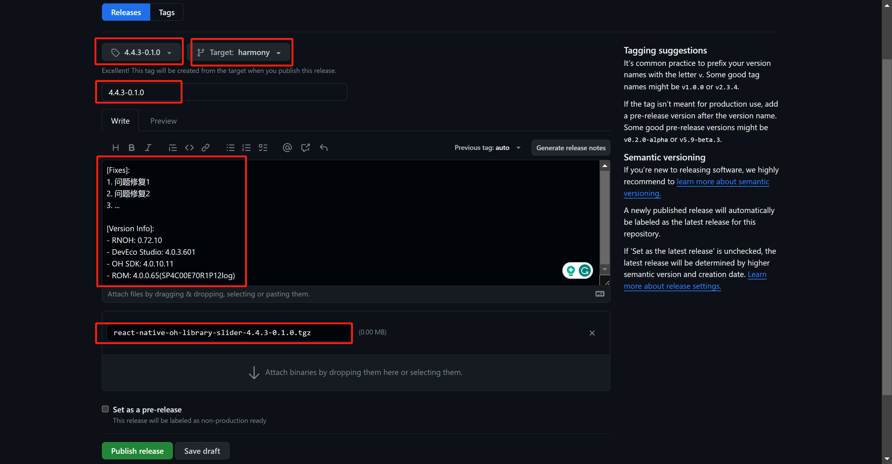

# 开源管理

本章节仅供内部开发者查阅，方便 RNOH 三方库后续展开开源工作。

目前所有的 RNOH 三方库在蓝区统一放在 [react-native-oh-library](https://github.com/orgs/react-native-oh-library/repositories) 组织管理，请相关开发者先申请加入。

## 建仓

!> 如果没有建仓权限，请联系组织管理员帮忙操作。

首先确认需要移植的 React-Native 三方库的原始仓库地址，然后 fork 默认分支（一般是 `master` 或 `main`）到 react-native-oh-library。Description 的内容改为这个三方库在 NPM 上的包名。


点击 "View all branches" 修改分支名称为 `harmony`，作为仓库的默认分支。开发时，请另外新建开发分支（推荐统一为 `dev`）。


如果发现落后原库默认分支，可点击 `Sync fork` 来跟进。sync 之后要注意原库版本有没有变更。

## 发布

发布步骤：

1. 确保已通过自检测试，并完成代码格式检查；
2. 将变更合入 `harmony` 分支；
3. 发布新的 Tag 和 Release（github操作）；
4. 发布新的 NPM Package（本地操作）。

### 代码格式检查

请查看 [代码格式检查](./codelint.md) 章节

### Tags and Releases

Tag 名称、Release 名称一致:

> x.x.x-y.y.y

其中x.x.x为基版本，即基于原库哪一个版本；y.y.y为鸿蒙化过程中自行定义的临时版本号。

release描述按以下格式：

```md
[Fixes]:
1. 问题修复1
2. 问题修复2
3. ...

[Version]:
- RNOH: 0.72.7
- DevEco Studio: 4.0.3.601
- OH SDK: 4.0.10.11
- ROM: 4.0.0.65(SP4C00E70R1P12log)
```



### Package 的命名规则：

**情况1.** 如果原库在 NPM 上的包带有组织前缀，如 "@react-native-community/slider", "@react-native-async-storage/async-storage"等；

去掉组织名取后半段：

> "@react-native-oh-library/原包名后半段"

example：

```md
"@react-native-community/slider" → "@react-native-oh-library/slider"

"@react-native-async-storage/async-storage" → "@react-native-oh-library/async-storage"
```

**情况2.** 如果原库在 NPM 上的包没有组织前缀，如 "react-native-pager-view" 等；

直接添加新的组织名：

> "@react-native-oh-library/原包名"

example：

```md
"react-native-pager-view" → "@react-native-oh-library/react-native-pager-view"
```

如果有重名等其他特殊情况，请联系组织管理员协商。

### Package 版本：

> x.x.x-y.y.y

其中x.x.x为基版本，即基于原库哪一个版本；y.y.y为鸿蒙化过程中自行定义的临时版本号。

### 添加别名

在 `package.json` 里添加 "harmony" 字段：

```json
{
    "harmony": {
        "alias": {原NPM包名}
    },
}
```

RNOH的打包工具会识别出 `node_modules` 下第一级目录的所有RNOH三方库的别名（第二级目录暂不支持，已提issue），这样在 JS 端 import 三方库使用的时候，可以使用原库的名字。如 import xxx from "@react-native-community/slider"。

### 将三方库的私有NPM包托管到github

请查阅 [发布三方库到Github Packages](./github-package.md)，也可参考 [@react-native-oh-library/react-native-slider](https://github.com/react-native-oh-library/react-native-slider)。


