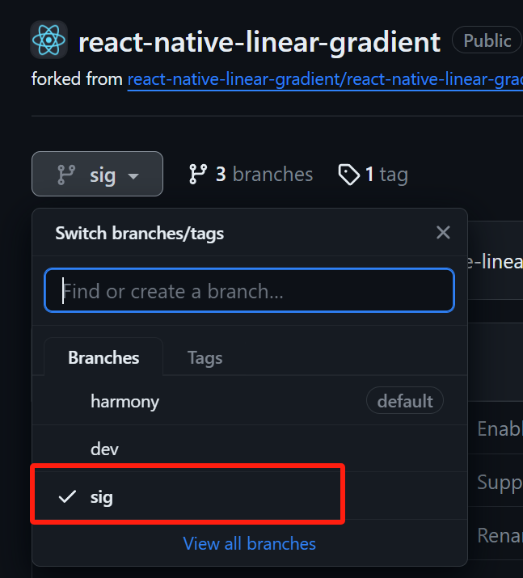
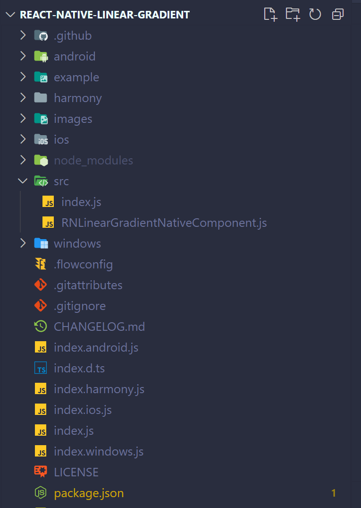
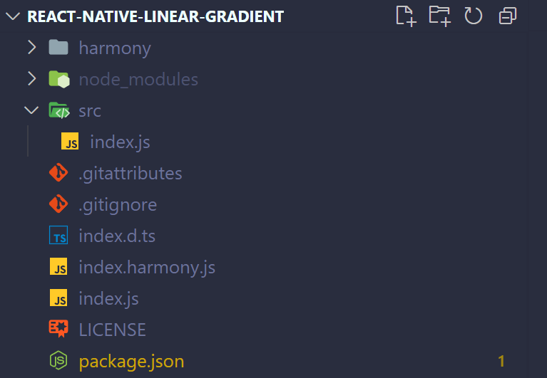

# 三方库文件结构整改（补丁形式）

## 背景

1130 前鸿蒙化后的 React-Native 三方库将 harmony 平台的修改和 Android、iOS 等平台的代码放在一起，然后覆盖原库安装。

这样做会面临三个问题：

1. Android 和 iOS 等其他平台需要依靠社区维护，有些库只支持老架构或只支持某个版本以下较老的 React-Native，而 harmony 只支持新架构和较新的 React-Native。如果放在一起无法保证一个库下，各个支持平台的一致性；

2. 外部厂商希望 Android、iOS 和 harmony 能在同一 React-Native 工程项目内，不需要另外新建针对 harmony 平台的 React-Native 工程。而大部分外部厂商在 Android、iOS 平台用的还是老架构版本的三方库，对于一些我们适配了 harmony 平台的老架构三方库，我们既无法保证 Android、iOS 等其他平台能正常在新架构运行，也无法保证在老架构还能运行；

3. 在开源之后需要在 Gitee 建仓，很难跟进 Github 的社区版本更新，无法直接 fork 也无法提 PR，将其他平台的代码包含进来对回合社区无任何意义。

## 变更项及原理

基于上述原因，经过各方面的考虑，1130 之后会对已适 harmony 平台的 React-Native 三方库进行文件结构整改，将覆盖原库的方式变更为打补丁的方式。

也就是说，将 harmony 平台的代码解耦出来，变成一个独立的 npm 包，和原来的 npm 包是依赖关系。当使用 metro 服务打包时，会根据平台和别名判断，需要去 node_modules 下哪个文件夹里取代码。

以 react-native-linear-gradient 为例，官方的 npm 包名是 react-native-linear-gradient，harmony 平台补丁的 npm 包名命名为 react-native-linear-gradient-openharmony。

#### Android/iOS

当在 React-Native 项目内运行 Android 或 iOS 平台时，与正常引入该三方库没有区别，JS 端的代码和原生代码都会从 `node_modules/react-native-linear-gradient` 里查询。

#### harmony

react-native-linear-gradient-openharmony 的 `package.json` 需要添加一个别名字段，这个别名就是原库的名字，用于给 metro 识别打包

```json
...
"harmony": {
    "alias": "react-native-linear-gradient"
}
```

当运行 harmony 平台时，metro 服务首先会进行别名查询，在每个三方库的 package.json 内查找有没有 `"harmony": {"alias"}` 字段。如有，将会和别名指向的库链接起来。

在打包的时候，将不会从 `node_modules/react-native-linear-gradient` 里拿取 JS 代码，而是从 `node_modules/react-native-linear-gradient-openharmony` 内拿取代码，但使用时 import 的库名称并不会改变，这就实现了 harmony 平台和其他平台的解耦。harmony 平台因目前还不支持 Autolink，所以原生代码自行指定路径即可。

## 示例

> [!tip] 补丁包的文件结构并没有太大变化，只是将 Android 和 ios 的原生部分、部分 JS 代码和一些无关项（example 工程等）剔除了，主要由两个部分组成：harmony 原生代码和修改后的 JS 代码。

**对于原生代码：**仅保留 harmony 平台的部分，即 `harmony` 文件夹。

**对于 JS 代码：**仅保留有改动的部分，其余直接从原库里 import。

首先需要在 github 仓库上新增 sig 分支，作为补丁版本的分支。

> [!WARNING] 目录结构还是需要和原库保持一致！



我们要尽量遵循能少改就少改的原则，对于新架构的三方库，剔除了其他平台后，如果 JS 代码无改动，理论上只需要重新在 index 中重新导出即可。若有 harmony 平台的改动，则需要保留。

> [!WARNING] 某些库的 `babel.config.json` 删除后会导致 bob build 报错，所以谨慎删除

如 react-native-linear-gradient

改动前：



改动后：



平台间的解耦不意味着 npm 包的解耦，实际上 JS 侧还需要依赖原库的代码。

所以还需要在 `package.json` 的 "dependencies" 字段添加对原库的依赖，版本填基于原库的版本。

```json
"dependencies": {
    "react-native-linear-gradient": "3.0.0-alpha.1"
  },
```

> [!WARNING] 整改后需要在  `tester` 工程验证

## 已整改完成可参考的库

| 原库名                         | 源码地址 |
| ------------------------------ | --------------------------------- |
| react-native-linear-gradient   | [OpenHarmony SIG](https://github.com/react-native-oh-library/react-native-linear-gradient/tree/sig) |
| @react-native-community/slider | [OpenHarmony SIG](https://github.com/react-native-oh-library/react-native-slider/tree/sig)          |
| @react-native-picker/picker    | [OpenHarmony SIG](https://github.com/react-native-oh-library/picker/tree/sig)                       |
| react-native-gesture-handler   | [OpenHarmony SIG](https://github.com/react-native-oh-library/react-native-gesture-handler/tree/sig) |
