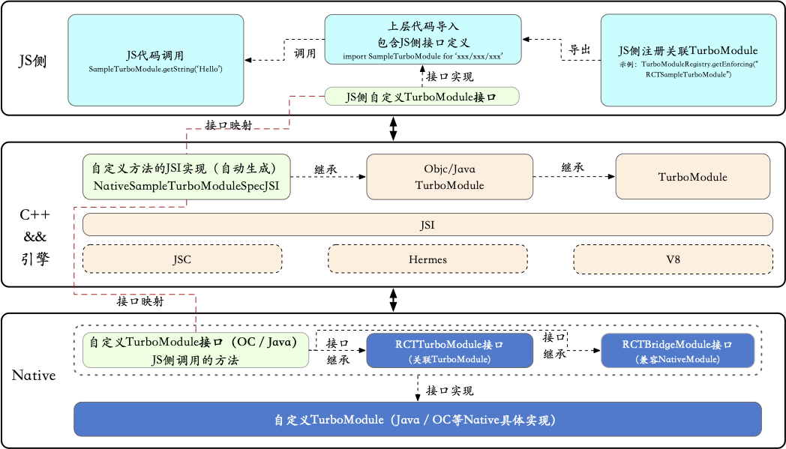

# TurboModules

Turbo Modules是升级版的Native Modules，是基于JSI开发的一套JS与Native交互的轻量级框架。TurboModules 本质上的作用是导出一系列的Native方法供JS使用。

详细的原理分析可以看：[React Native之新架构中的Turbo Module实现原理分析](https://cloud.tencent.com/developer/article/1889895)



## 如何创建 TurboModule

创建一个 Turbo Native Module 分为以下步骤：

1. 声明 JavaScript 接口类型；
2. 配置模块以支持 Codegen 自动生成脚手架代码；
3. 编写原生代码完成模块实现。

接下来会创建一个简单的名为 `RTNCalculator` 的 TurboModule 作为示例。

### 1. 目录配置

我们按照一般的三方库目录结构来配置:

```md
.
└── RTNCalculator
    ├── android（Android 的原生实现代码）
    ├── ios（iOS 的原生实现代码）
    ├── harmony（Harmony 的原生实现代码）
    └── src （js/ts代码）
```

### 2. 声明 JavaScript 接口

新架构要求必须使用强类型风格语言声明 JavaScript 接口（Flow 和 TypeScript 皆可）。Codegen 会根据这些接口声明来生成强类型的语言，其中包括 C++、Objective-C 和 Java。

对于声明类型的代码文件必须满足以下两点要求：

1. 文件必须使用 `Native<MODULE_NAME>`命名，在使用 Flow 时，以 .js 或 .jsx 为后缀名；在使用 **Typescript** 时，以 `.ts` 或 `.tsx` 为后缀名。**Codegen** 只会找到匹配这些命名规则的文件；
2. 代码中必须要输出 `TurboModuleRegistrySpec` 对象

!> 推荐使用typescript

<!-- tabs:start -->

#### **typescript**

NativeCalculator.ts
```ts
import type {TurboModule} from 'react-native/Libraries/TurboModule/RCTExport';
import {TurboModuleRegistry} from 'react-native';

export interface Spec extends TurboModule {
  add(a: number, b: number): Promise<number>;
}

export default TurboModuleRegistry.get<Spec>(
  'RTNCalculator',
) as Spec | null;
```

#### **flow**

NativeCalculator.js
```js
// @flow
import type { TurboModule } from 'react-native/Libraries/TurboModule/RCTExport';
import { TurboModuleRegistry } from 'react-native';

export interface Spec extends TurboModule {
  add(a: number, b: number): Promise<number>;
}
export default (TurboModuleRegistry.get<Spec>(
  'RTNCalculator'
): ?Spec);
```
<!-- tabs:end -->

在代码顶部需导入以下两个声明文件：

- 类型 TurboModule ：定义 Turbo Native Module 的基础接口
- JS 模块 TurboModuleRegistry：包含了用于加载 Turbo Native Module 的函数

代码的第二个部分就是针对 Turbo Native Module 的接口声明。在本例中，接口声明了 `add` 函数，它将用于接受两个数字并返回一个包装数字的 Promise。为声明 Turbo Native Module，此接口**必须**命名为 Spec。

最后，调用 `TurboModuleRegistry.get` 并传入模块名，它将在 Turbo Native Module 可用的时候进行加载。

### 3. Codegen 配置
接下来，需要为 Codegen 和自动链接添加一些配置。

有一些配置文件在 Android/iOS/Harmony 平台是通用的，而有的仅能在某一平台使用。

#### Shared

shared 是 package.json 文件中的一个配置项，它将在 yarn 安装模块时被调用。请在 `RTNCalculator` 的根目录创建 `package.json` 文件。

```json
{
  "name": "rtn-calculator",
  "version": "0.0.1",
  "description": "Add numbers with TurboModules",
  "react-native": "src/index",
  "source": "src/index",
  "files": [
    "src",
    "android",
    "ios",
    "harmony",
    "rtn-calculator.podspec",
    "!android/build",
    "!ios/build",
    "!**/__tests__",
    "!**/__fixtures__",
    "!**/__mocks__"
  ],
  "keywords": ["react-native", "ios", "android"],
  "repository": "https://github.com/<your_github_handle>/rtn-calculator",
  "author": "<Your Name> <your_email@your_provider.com> (https://github.com/<your_github_handle>)",
  "license": "MIT",
  "bugs": {
    "url": "https://github.com/<your_github_handle>/rtn-calculator/issues"
  },
  "homepage": "https://github.com/<your_github_handle>/rtn-calculator#readme",
  "devDependencies": {},
  "peerDependencies": {
    "react": "*",
    "react-native": "*"
  },
  "codegenConfig": {
    "name": "RTNCalculatorSpec",
    "type": "modules",
    "jsSrcsDir": "src",
    "android": {
      "javaPackageName": "com.rtncalculator"
    }
  }
}
```

将 Codegen 的配置声明到 codegenConfig 字段。codegenConfig 是一个用于存放要生成的第三方库的对象数组，每个对象又包含其它三个字段：

- name：第三方库的名称。按照惯例，名称应以 Spec 为结尾
- type：在这个 npm 包里的模块类型。在本例中，我们开发的是 Turbo Native Module，所以值为 modules
- jsSrcsDir：用于找到 js 接口声明文件的相对路径，它将被 Codegen 解析
- android.javaPackageName：由 Codegen 生成的 Java 包名 (需与 AndroidManifest.xml 中包名一致)

#### Android

若要在 Android 平台运行 Codegen，需要创建三个文件：

1. 带有 Codegen 配置信息的 build.gradle 文件
2. AndroidManifest.xml
3. 一个实现 ReactPackage 接口的 Java 类
在文件创建完成后，android 目录文件结构应该是这样的：

```md
android
├── build.gradle
└── src
    └── main
        ├── AndroidManifest.xml
        └── java
            └── com
                └── rtncalculator
                    └── CalculatorPackage.java
```

首先，在 `android` 目录创建 `build.gradle` 文件，并配置以下内容：

<!-- tabs:start -->
#### **build.gradle**
```gradle
buildscript {
  ext.safeExtGet = {prop, fallback ->
    rootProject.ext.has(prop) ? rootProject.ext.get(prop) : fallback
  }
  repositories {
    google()
    gradlePluginPortal()
  }
  dependencies {
    classpath("com.android.tools.build:gradle:7.1.1")
  }
}

apply plugin: 'com.android.library'
apply plugin: 'com.facebook.react'

android {
  compileSdkVersion safeExtGet('compileSdkVersion', 31)
}

repositories {
  maven {
    // All of React Native (JS, Obj-C sources, Android binaries) is installed from npm
    url "$projectDir/../node_modules/react-native/android"
  }
  mavenCentral()
  google()
}

dependencies {
  implementation 'com.facebook.react:react-native:+'
}
```
<!-- tabs:end -->

其次，创建 `android/src/main` 目录，然后在这个目录内创建 `AndroidManifest.xml` 文件，并编写以下代码：

<!-- tabs:start -->
#### **AndroidManifest.xml**
```xml
<manifest xmlns:android="http://schemas.android.com/apk/res/android"
          package="com.rtncalculator">
</manifest>
```
<!-- tabs:end -->

这个 manifest 文件的用途是声明您开发的模块的 Java 包

最后，您需要一个继承 TurboReactPackage 接口的类。在运行 Codegen 前，您不用完整实现这个类。对于 App 而言，一个没有实现接口的空类就已经能当做一个 React Native 依赖，Codegen 会尝试生成其脚手架代码。

创建 `android/src/main/java/com/rtncalculator` 目录，在这个目录内创建 `CalculatorPackage.java` 文件

<!-- tabs:start -->
#### **CalculatorPackage.java**
```java
package com.rtncalculator;

import androidx.annotation.Nullable;
import com.facebook.react.bridge.NativeModule;
import com.facebook.react.bridge.ReactApplicationContext;
import com.facebook.react.module.model.ReactModuleInfoProvider;
import com.facebook.react.TurboReactPackage;

import java.util.Collections;
import java.util.List;

public class CalculatorPackage extends TurboReactPackage {

  @Nullable
  @Override
  public NativeModule getModule(String name, ReactApplicationContext reactContext) {
          return null;
  }

  @Override
  public ReactModuleInfoProvider getReactModuleInfoProvider() {
      return null;
  }
}
```
<!-- tabs:end -->

ReactPackage 接口的用途是让 React Native 为使用 App 中的 ViewManager 和 Native Modules，识别出哪些原生类需要在第三方库里导出。

Codegen 会在 App 编译的时候自动运行。

#### Harmony

Harmony 平台暂时还没有 Codegen，所以我们需要手动运行 Android 的 Codegen，然后把生成的代码复制过来使用。

!> 请务必先把 Android 的 Codegen 配置好再执行以下操作

首先我们需要一个 React-Native App来执行 Codegen，假设 App 的目录是和 当前目录平级的 `MyApp`，执行以下命令来创建一个 Gradle 任务来执行 Codegen。

!> 在运行 Codegen 之前，您需要在 Android 中的 App 启动新架构。您可以通过修改 gradle.properties 文件中的 newArchEnabled 属性，将 false 改为 true。

```bash
cd MyApp
yarn add ../RTNCalculator
cd android
./gradlew generateCodegenArtifactsFromSchema
```

生成后的代码保存在 `MyApp/node_modules/rtn-calculator/android/build/generated/source/codegen` 目录，并呈以下结构：

```md
codegen
├── java
│   └── com
│       └── RTNCalculator
│           └── NativeCalculatorSpec.java
├── jni
│   ├── Android.mk
│   ├── RTNCalculator-generated.cpp
│   ├── RTNCalculator.h
│   └── react
│       └── renderer
│           └── components
│               └── RTNCalculator
│                   ├── ComponentDescriptors.h
│                   ├── EventEmitters.cpp
│                   ├── EventEmitters.h
│                   ├── Props.cpp
│                   ├── Props.h
│                   ├── ShadowNodes.cpp
│                   └── ShadowNodes.h
└── schema.json
```

`codegen/jni/react/renderer/components/RTNCalculator` 下的代码是 Harmony 需要的。

### 4. 原生代码

#### Android

Android 平台上 Turbo Native Module 的原生代码需执行如下步骤：

1. 创建用于实现模块的 CalculatorModule.java
2. 修改之前生成的 CalculatorPackage.java

 Android 第三方库目录文件结构应为如下：
 ```md
 android
├── build.gradle
└── src
    └── main
        ├── AndroidManifest.xml
        └── java
            └── com
                └── rtncalculator
                    ├── CalculatorModule.java
                    └── CalculatorPackage.java
 ```

创建 CalculatorModule.java

<!-- tabs:start -->
#### **CalculatorModule.java**
```java
package com.rtncalculator;

import androidx.annotation.NonNull;
import com.facebook.react.bridge.NativeModule;
import com.facebook.react.bridge.Promise;
import com.facebook.react.bridge.ReactApplicationContext;
import com.facebook.react.bridge.ReactContext;
import com.facebook.react.bridge.ReactContextBaseJavaModule;
import com.facebook.react.bridge.ReactMethod;
import java.util.Map;
import java.util.HashMap;

public class CalculatorModule extends NativeCalculatorSpec {

    public static String NAME = "RTNCalculator";

    CalculatorModule(ReactApplicationContext context) {
        super(context);
    }

    @Override
    @NonNull
    public String getName() {
        return NAME;
    }

    @Override
    public void add(double a, double b, Promise promise) {
        promise.resolve(a + b);
    }
}
```
<!-- tabs:end -->

这个类实现了模块的功能，它继承了 NativeCalculatorSpec 类，而这个类是之前从 JavaScript 接口声明文件 NativeCalculator 自动生成的。

修改 CalculatorPackage.java

<!-- tabs:start -->
#### **CalculatorPackage.java**
```diff
package com.rtncalculator;

import androidx.annotation.Nullable;
import com.facebook.react.bridge.NativeModule;
import com.facebook.react.bridge.ReactApplicationContext;
+ import com.facebook.react.module.model.ReactModuleInfo;
import com.facebook.react.module.model.ReactModuleInfoProvider;
import com.facebook.react.TurboReactPackage;

import java.util.Collections;
import java.util.List;
+ import java.util.HashMap;
+ import java.util.Map;

public class CalculatorPackage extends TurboReactPackage {

  @Nullable
  @Override
  public NativeModule getModule(String name, ReactApplicationContext reactContext) {
+      if (name.equals(CalculatorModule.NAME)) {
+          return new CalculatorModule(reactContext);
+      } else {
          return null;
+      }
  }


  @Override
  public ReactModuleInfoProvider getReactModuleInfoProvider() {
-      return null;
+      return () -> {
+          final Map<String, ReactModuleInfo> moduleInfos = new HashMap<>();
+          moduleInfos.put(
+                  CalculatorModule.NAME,
+                  new ReactModuleInfo(
+                          CalculatorModule.NAME,
+                          CalculatorModule.NAME,
+                          false, // canOverrideExistingModule
+                          false, // needsEagerInit
+                          true, // hasConstants
+                          false, // isCxxModule
+                          true // isTurboModule
+          ));
+          return moduleInfos;
+      };
  }
}
```
<!-- tabs:end -->

这就是 Android 平台原生代码的最后一部分，它定义了 TurboReactPackage 对象，这个对象将用于 App 的模块加载。

#### Harmony

### 将 Turbo Native Module 添加到 App

#### Shared

首先，需要将包含模块的 NPM 包添加到 App。可以使用以下命令执行此操作：

```bash
cd MyApp
yarn add ../RTNCalculator
```

此命令会将 RTNCalculator 模块添加到 App 内的 node_modules 目录。

#### Android

在配置 Android 之前，您需要先开启新架构：

1. 打开 android/gradle.properties；
2. 滑到文件底部，将 newArchEnabled 的值从 false 修改为 true。

#### Harmony

#### JavaScript

以下是一个在 App.js 中调用 add 方法的例子：

<!-- tabs:start -->
#### **App.js**
```js
/**
 * Sample React Native App
 * https://github.com/facebook/react-native
 *
 * @format
 * @flow strict-local
 */
import React from 'react';
import {useState} from 'react';
import type {Node} from 'react';
import {
  SafeAreaView,
  StatusBar,
  Text,
  Button,
} from 'react-native';
import RTNCalculator from 'rtn-calculator/js/NativeCalculator.js';

const App: () => Node = () => {
  const [result, setResult] = useState<number | null>(null);
  return (
    <SafeAreaView>
      <StatusBar barStyle={'dark-content'} />
      <Text style={{marginLeft: 20, marginTop: 20}}>
        3+7={result ?? '??'}
      </Text>
      <Button
        title="Compute"
        onPress={async () => {
          const value = await RTNCalculator.add(3, 7);
          setResult(value);
        }}
      />
    </SafeAreaView>
  );
};
export default App;
```
<!-- tabs:end -->
